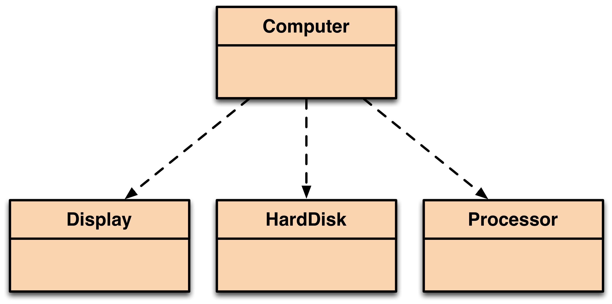

# Part 1: Basics

In this first part, we will take the problem domain of modeling a computer.  First we will decide which classes are important to include.  We will have a `Computer` class.  Its role is to store other objects that model the components of a computer (the `Processor`, the `HardDisk`, and the `Display`).  Each component will have its own class.  The class diagram is as follows:



The following requirements must be implemented in Java:

## The Computer Class

3 fields:

```java
private Processor theProcessor
private HardDisk theHardDisk
private Memory theDisplay
```

1 constructor:

```java
// constructor for Computer
// takes no parameters
// it call the constructor of each of the fields
public Computer() {
	// your code
}
```

1 method:

```java
// print a summary of the Computer components and calculate a total cost
// you will need method calls to get info about the other components
// e.g. theProcessor.getCost()
public void printComputerSummary() {
	// your code here
}
```

## The Component Classes

You have to decide how to model these classes.  The basic requirement is that each class `Processor`, `HardDisk` and `Display` will have a set of fields that are appropriate (e.g. the Processor class will have a `manufacturer` (e.g. "AMD") and `clockspeed` field (e.g. 1000); if you want to add more, you can).  All three classes must have a `cost` field.

Each of these three classes will have the appropriate accessor and mutator methods (also known as getter and setter methods) to access and update these fields.  Finally each will have a constructor method to create objects and populate the fields with values.

You are free to use BlueJ or any other IDE to implement your solution.

[Continue to Part 2: Store](../part-2-store)
