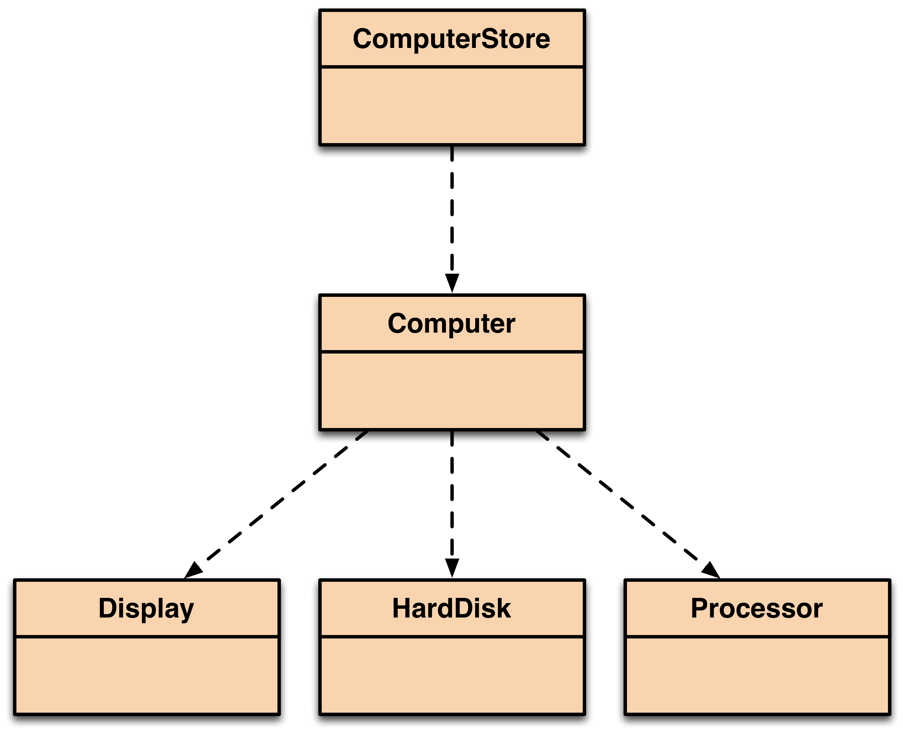
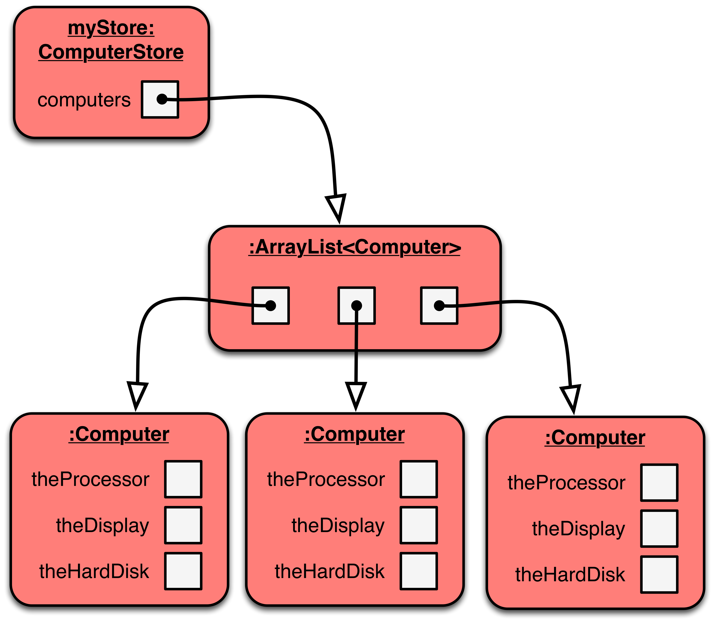

# Part 2: Store

In this part, we will extend part 1 and will try to model a computer store that sells different configurations of computers.  In this project we will use a collection to manage many computers and use iteration to process the whole collection.

Here is the new class diagram for our project:



And here is an object diagram of a running project as an example, where a `ComputerStore` instance has been created, and three computer objects have been added to its collection called `computers`:



## Develop ComputerStore

1. Create a new class called `ComputerStore`
2. `ComputerStore` has the one field called `computers`
3. `computers` will be of type `ArrayList` (remember to import)
4. `computers` will only store objects of type `Computer`
5. `ComputerStore` will have a constructor that initialises the `computers` field
6. `ComputerStore` will have the following methods:

```java
public boolean addComputer(Computer newComputer) { ... }

public boolean removeComputer(int index) { ... }

public void printAllComputers( ) {
	// prints out all the details of each computer in store
}

public void printTotalValue( ) {
	// prints the total cost for all computers
}
```

You should provide implementations for these methods and then test they work as expected. Please remember to describe all of your methods with comments.

## Finding the most expensive Computer

We want to add a new feature to `ComputerStore`, to find the most expensive computer.

This method will search through the collection of computers and determine which computer is the most expensive.  It may help to implement a helper method that returns the total price (e.g. public int `getTotalPrice( )`).  You will also need to maintain a local variable called `currentMostExpensive` as you loop through the collection to compare with each computer.  Finally, the method should return the most expensive computer.  Please test with at least three `Computer` objects.

You must implement this in four different ways:

```java
public Computer findMostExpensiveComputerV1( ) { … }
// This version will use a traditional for loop
```

```java
public Computer findMostExpensiveComputerV2( ) { … }
// This version will use a traditional while loop
```

```java
public Computer findMostExpensiveComputerV3( ) { … }
// This version will use a for-each loop
```

```java
public Computer findMostExpensiveComputerV4( ) { … }
// This version will use an Iterator object with a while loop
```

Your final task is to decide which is best and say why in a few words as a comment in the chosen method version.
