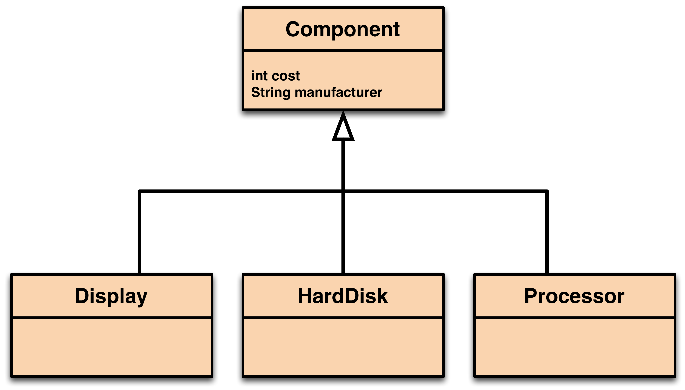

# Part 3: Flexibility

The computer store management also wants to create a collection of spare parts that it can sell to customers, i.e. that are not in a Computer, but independent.  Create a super class called `Component` and have `Display`, `HardDisk`, and `Processor` be sub-classes.



The component class will have two fields that are common for all sub classes:

```java
private String manufacturer;
private int Cost
```

The `Component` class will also have a `getCost()` and `getDescription()` methods that have public access and appropriate return types.

The subclasses `Display`, `HardDisk` and `Processor` classes must be updated to inherit from `Component` class, remove any fields that are not needed, and override any methods of the `Component` class that needed to be specialised to include more information.

Use an `ArrayList<Component>` called `components` to model the various components that are currently stored. Write a method to print out the total value of all components.  Its signature is:

```java
public int totalCostOfComponents( ) { ... }
```

Write a second method with the same name, except it takes a `String` as a parameter and only prints out the total of the parameter string, if it is a legal type.  (hint: the `instanceof` operator may help or using the `Object` and `Class` classes from `java.lang`).

```java
public int totalCostOfComponents(String component_type) { ... }
```

## General Purpose Computer

The computers sold so far only consists of three fixed components, however customers want to build custom computers and currently, the implementation of `Computer` does not allow for this. Replace the fields `Processor` and `Display` and `HardDisk` with a single `HashMap<String, Component>` called `configuration`.

The main idea is that a customer can now build a computer by the following code (perhaps in a main method):

```java
// create a default basic configuration
Computer myPC = new Computer( );

// Add a hard disk
Component hdd1 = new HardDisk(“Seagate”, 150, “2TB”);
myPC.addComponent(“hard disk 1”, hdd1);

// Add a second hard disk
Component hdd2 = new HardDisk(“Seagate”, 150, “2TB”);
myPC.addComponent(“hard disk 2”, hdd2);

// etc
```

Create new methods to `addComponent(String name, Component c)` and `removeComponent(String name)`. Update your implementation of `ComputerStore` to reflect this final version. Test you methods work as expected.  Ensure you document your source code using JavaDoc comments.

You are done! Make sure to email your repo url 😄
